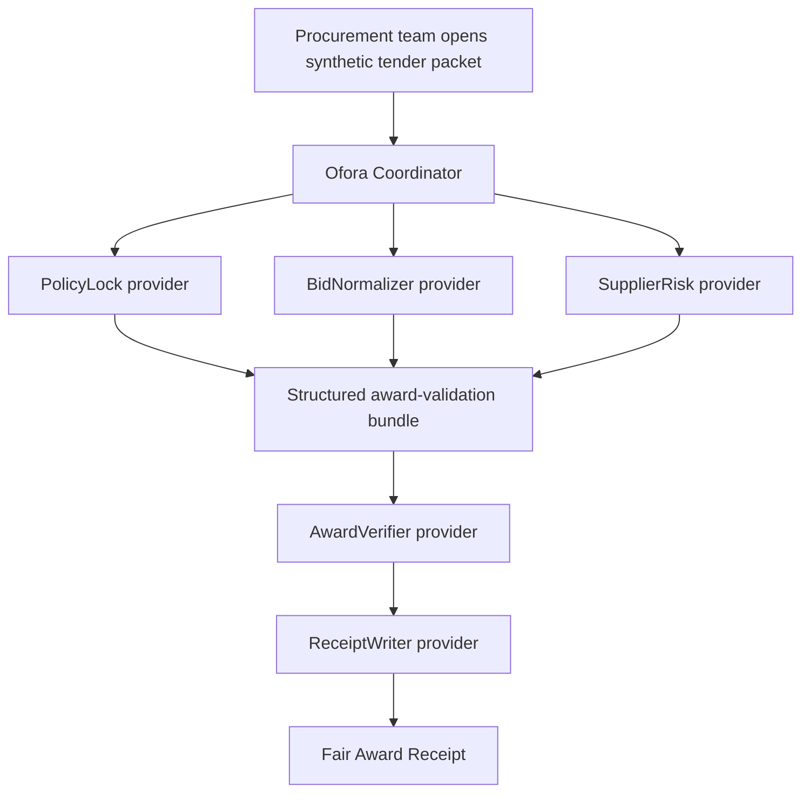

# Ofora Agents

Ofora Agents is a paid multi-agent award-validation pipeline for confidential procurement. It coordinates independently callable specialist agents to validate a selected supplier against a locked evaluation policy and produce a Fair Award Receipt.

Ofora Agents uses a synthetic tender packet in demo mode. It does not expose confidential supplier bids, replace procurement officers, guarantee legal compliance, store supplier secrets in demo mode, or publish raw commercial proposals.

## Why Ofora Agents fits CROO

Ofora maps naturally to the CROO Agent Protocol because the product is built from independently callable paid provider agents:

- PolicyLock validates locked award criteria.
- BidNormalizer structures supplier submissions.
- SupplierRisk flags missing documentation, declared conflicts, and delivery-readiness risks.
- AwardVerifier checks the selected supplier against the locked policy.
- ReceiptWriter generates the Fair Award Receipt.

The coordinator creates a CAP order for each specialist, handles negotiation, payment, delivery retrieval, and receipt display. In live mode, CROO provides the order lifecycle, settlement, and delivery proof surface needed for agent-to-agent orchestration.

## Architecture



## Setup

```bash
npm install
cp .env.example .env.local
npm run dev
```

Open `http://localhost:3000`.

## Environment Variables

| Variable | Required | Purpose |
| --- | --- | --- |
| `DEMO_MODE` | Yes | `true` uses generated demo receipts and mock CAP flow. `false` calls CROO. |
| `LIVE_SPECIALISTS` | Live CAP | Use `policy,bids,risk` for the three live upstream specialists. AwardVerifier and ReceiptWriter remain simulated fallback. |
| `ALLOW_LIVE_FALLBACK` | Optional | Defaults to `false`. If `true`, PolicyLock may visibly fall back to simulation after live CAP failure. |
| `CROO_API_URL` | Live CAP | CROO API endpoint. |
| `CROO_WS_URL` | Live CAP | CROO websocket endpoint for events. |
| `CROO_COORDINATOR_SDK_KEY` | Live PolicyLock | SDK key for the Ofora Coordinator requester agent. |
| `POLICY_LOCK_SDK_KEY` | Live PolicyLock provider | SDK key for the PolicyLock provider agent. |
| `POLICY_LOCK_SERVICE_ID` | Live PolicyLock | Dashboard service ID negotiated by the coordinator. |
| `BID_NORMALIZER_SDK_KEY` | Live BidNormalizer provider | SDK key for the BidNormalizer provider agent. |
| `BID_NORMALIZER_SERVICE_ID` | Live BidNormalizer | Dashboard service ID negotiated by the coordinator. |
| `SUPPLIER_RISK_SDK_KEY` | Live SupplierRisk provider | SDK key for the SupplierRisk provider agent. |
| `SUPPLIER_RISK_SERVICE_ID` | Live SupplierRisk | Dashboard service ID negotiated by the coordinator. |
| `AWARD_VERIFIER_SDK_KEY` | Future live provider | SDK key for AwardVerifier when its live provider is enabled. |
| `RECEIPT_WRITER_SDK_KEY` | Future live provider | SDK key for ReceiptWriter when its live provider is enabled. |
| `BASE_RPC_URL` | Optional live CAP | Base RPC endpoint used by the installed SDK for balance checks. |
| `CAP_ORDER_TIMEOUT_MS` | Optional live CAP | Requester timeout. Defaults to `120000`. |
| `OPENAI_API_KEY` | Optional live generation | Used only by AwardVerifier when `DEMO_MODE=false`. |

## Live CAP Mode Versus Demo Mode

`DEMO_MODE=true` is for UI work before credentials are ready. It generates transaction-like IDs and delivery hashes, but the UI clearly labels them as simulated receipts and does not claim live settlement.

`DEMO_MODE=false` with `LIVE_SPECIALISTS=policy,bids,risk` uses the CROO SDK architecture in `lib/croo/client.ts`, `lib/croo/request-policy-lock.ts`, `lib/croo/request-bid-normalizer.ts`, `lib/croo/request-supplier-risk.ts`, and `lib/croo/request-specialist-agent.ts`:

1. Connect the WebSocket.
2. `negotiateOrder({ serviceId, requirements })`
3. Receive `EventType.OrderCreated`
3. `payOrder(orderId)`
4. Receive `EventType.OrderCompleted`
5. `getDelivery(orderId)`
6. Parse and zod-validate JSON delivery
7. Emit status updates for the UI

The installed `@croo-network/sdk` version exposes:

- `new AgentClient({ baseURL, wsURL, rpcURL? }, sdkKey)`
- `EventType.NegotiationCreated`, `OrderCreated`, `OrderPaid`, `OrderCompleted`, plus rejected/expired events
- `DeliverableType.Text` as `"text"`
- event fields such as `negotiation_id`, `order_id`, and `service_id`
- `payOrder(orderId)` returning `txHash` and `order`
- `getDelivery(orderId)` returning `deliveryId`, `contentHash`, and `deliverableText`

Confidential submissions are not placed on-chain. The live PolicyLock CAP request sends only `tenderReference`, `lockedAt`, `validationRequestedAt`, and locked policy criteria. It does not send supplier bid amounts, supplier documents, raw commercial proposals, buyer secrets, or unnecessary supplier data. The demo tender remains in server memory for the demo.

## Live CAP integration: three upstream specialists

This CAP path proves three paid specialist counterparties running in parallel:

```text
Ofora Coordinator -> PolicyLock negotiation -> CAP payment -> PolicyLock delivery -> validated JSON output
Ofora Coordinator -> BidNormalizer negotiation -> CAP payment -> BidNormalizer delivery -> validated JSON output
Ofora Coordinator -> SupplierRisk negotiation -> CAP payment -> SupplierRisk delivery -> validated JSON output
```

The downstream specialists remain simulated fallback for now:

- AwardVerifier
- ReceiptWriter

Current configured hackathon pricing:

| Service | Current configured price |
| --- | ---: |
| Ofora Coordinator | $0.30 USDC |
| PolicyLock | $0.05 USDC |
| BidNormalizer | $0.05 USDC |
| SupplierRisk | $0.05 USDC |
| AwardVerifier | $0.05 USDC |
| ReceiptWriter | $0.05 USDC |
| Total specialist spend | $0.25 USDC |
| Coordinator margin | $0.05 USDC |

The application displays these current configured prices from `lib/config/pricing.ts`. Update the CROO Dashboard manually for each registered service to match them; changing code constants does not update already-published CROO service prices. Existing settled transactions are immutable historical records. The original completed PolicyLock order `a4a3efe2-4de6-4836-9454-cd96d727faf8` remains a historical $0.40 USDC transaction, even though the current PolicyLock catalog price is $0.05 USDC.

Dashboard prerequisites:

- Create or identify the Ofora Coordinator agent.
- Create or identify the PolicyLock provider agent.
- Register the PolicyLock service.
- Generate separate SDK keys for Coordinator and PolicyLock.
- Copy the PolicyLock service ID.
- Fund the Ofora Coordinator agent AA wallet with sufficient payment tokens.

Required live environment:

```bash
DEMO_MODE=false
LIVE_SPECIALISTS=policy,bids,risk
CROO_API_URL=https://api.croo.network
CROO_WS_URL=wss://api.croo.network/ws
BASE_RPC_URL=https://mainnet.base.org
CROO_COORDINATOR_SDK_KEY=...
POLICY_LOCK_SDK_KEY=...
POLICY_LOCK_SERVICE_ID=...
BID_NORMALIZER_SDK_KEY=...
BID_NORMALIZER_SERVICE_ID=...
SUPPLIER_RISK_SDK_KEY=...
SUPPLIER_RISK_SERVICE_ID=...
CAP_ORDER_TIMEOUT_MS=120000
ALLOW_LIVE_FALLBACK=false
```

Use full unmasked SDK keys in `.env.local`. The masked `croo_sk_****...` value shown in the CROO Dashboard UI cannot be used by provider processes. Keep `.env.local` ignored by Git and never paste SDK keys into `package.json`, README, or source files.

Terminal 1:

```bash
npm run provider:policy
```

Terminal 2:

```bash
npm run provider:bids
```

Terminal 3:

```bash
npm run provider:risk
```

Terminal 4:

```bash
DEMO_MODE=false LIVE_SPECIALISTS=policy,bids,risk npm run dev
```

Production:

```bash
npm run build
DEMO_MODE=false LIVE_SPECIALISTS=policy,bids,risk npx next start -p 3001
```

Expected provider logs:

- `[PolicyLock] Negotiation received`
- `[PolicyLock] Requirements validated`
- `[PolicyLock] Negotiation accepted`
- `[PolicyLock] Order created: <order id>`
- `[PolicyLock] Payment confirmed: <order id>`
- `[PolicyLock] Policy validation completed`
- `[PolicyLock] Delivery submitted: <order id>`
- `BidNormalizer: delivered <order id> as <delivery hash>`
- `SupplierRisk: delivered <order id> as <delivery hash>`

Expected workspace result:

- PolicyLock: `LIVE CAP` · `Delivered`
- BidNormalizer: `LIVE CAP` · `Delivered`
- SupplierRisk: `LIVE CAP` · `Delivered`
- AwardVerifier: `Simulated fallback` · `Delivered`
- ReceiptWriter: `Simulated fallback` · `Delivered`
- Top badge after the three upstream specialists return real receipt references: `MIXED MODE · 3 live receipt(s)`
- Receipts page separates verified CAP receipts for PolicyLock, BidNormalizer, and SupplierRisk from simulated fallback references for AwardVerifier and ReceiptWriter.
- Three live upstream specialist payments are shown as `$0.15 USDC` in service payments; the full five-agent configured specialist spend remains `$0.25 USDC`.

Troubleshooting:

- Insufficient balance: fund the Coordinator agent AA wallet, not only the controller address.
- Invalid SDK key: verify Coordinator and PolicyLock keys are separate and current.
- Missing service ID: set `POLICY_LOCK_SERVICE_ID`.
- Provider not running: start `npm run provider:policy`, `npm run provider:bids`, and `npm run provider:risk` before running validation.
- WebSocket timeout: confirm `CROO_WS_URL` and that the dashboard service is available.
- Invalid delivery schema: PolicyLock delivery must be JSON matching `PolicyLockOutputSchema`.

Missing live references are never fabricated. If the SDK returns an order ID but no payment or delivery hash, the UI leaves absent fields unavailable rather than generating fake hashes.

## Provider Processes

Run providers in separate terminals:

```bash
npm run provider:policy
npm run provider:bids
npm run provider:risk
npm run provider:award
npm run provider:receipt
```

All provider commands load `.env.local` with Node's `--env-file=.env.local` flag and run TypeScript through `--import tsx`. There is currently no `scripts/providers/coordinator.ts`; the Ofora Coordinator acts as the requester inside the Next.js app. A configured CROO dashboard agent does not automatically mean its live provider code is implemented.

Provider behavior:

- `scripts/providers/policy-lock.ts` is the first real CROO provider. It accepts paid PolicyLock CAP orders, validates locked policy integrity, and returns `DeliverableType.Text` JSON.
- `scripts/providers/bid-normalizer.ts` accepts paid BidNormalizer CAP orders, normalizes synthetic supplier submissions, and returns `DeliverableType.Text` JSON.
- `scripts/providers/supplier-risk.ts` accepts paid SupplierRisk CAP orders, screens documentation/conflict/delivery indicators, and returns `DeliverableType.Text` JSON.
- `scripts/providers/award-verifier.ts` is present for future provider work, but AwardVerifier remains simulated fallback in the current verified live scope.
- `scripts/providers/receipt-writer.ts` is present for future provider work, but ReceiptWriter remains simulated fallback in the current verified live scope.

## Audit Boundaries

- Does not expose confidential supplier bids.
- Does not replace procurement officers.
- Does not guarantee legal compliance.
- Does not store supplier secrets in demo mode.
- Does not publish raw commercial proposals.

## Demo Packet

- Tender ID: OFR-2026-041
- Tender: Emergency Solar Lantern Procurement
- Buyer: Global Relief & Infrastructure Network
- Selected supplier: Nova Relief Systems
- Managed value: $10,000
- Status: Award pending validation
- Purpose: validate that the selected supplier follows the locked evaluation policy without publishing raw supplier proposals.

## Hackathon Demo Script

1. Open the landing page and introduce Ofora Agents as confidential procurement award validation.
2. Click “Open synthetic tender.”
3. Point out the synthetic-only badge and audit boundaries.
4. Click “Validate award” and narrate the five paid specialist orders.
5. Show receipts and economics disclosure.
6. Open the Fair Award Receipt and walk through locked policy confirmation, supplier normalization, risk flags, award review notes, audit boundaries, and CAP receipts.

## Recording Notes

For clean demo recordings without development overlays, run a production build and start the production server:

```bash
npm run build
npm run start
```

## Commands

```bash
npm run dev
npm run build
npm run start
npm run lint
npm run typecheck
npm test
```
